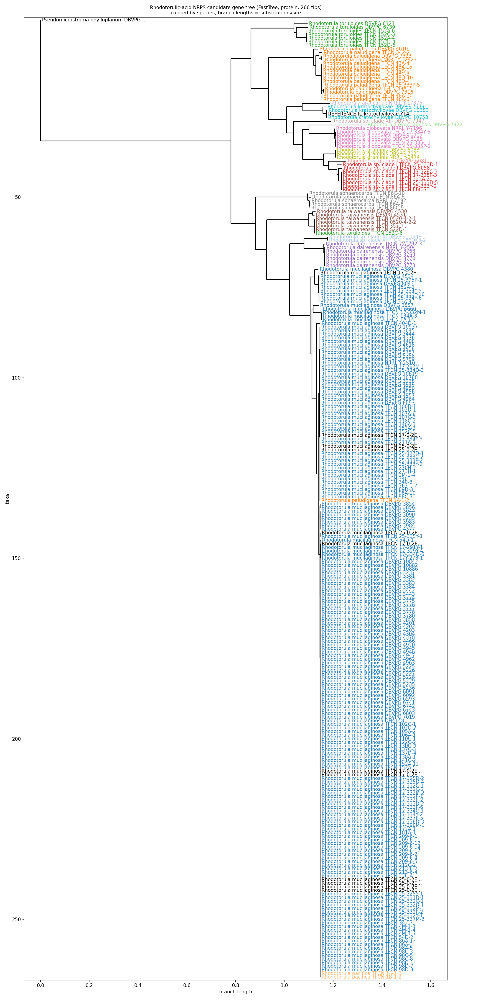

# Siderophore / iron-sequestration investigation (2026-08-16)

PI request: (1) what iron-chelating chemistry (rhodotorulic acid and
relatives) can be detected in the MS data at all, (2) per-strain
presence/absence, (3) cross-reference against the NRPS gene known to
synthesize rhodotorulic acid.

## Step 1: mass search — detected

**Script**: `analysis/scripts/siderophore_mass_remining.py` (same design
as `idea1_targeted_mass_remining.py`). Searched 4 compounds × 4 adducts
([M+H]+, [M+Na]+, [M+NH4]+, [M+K]+ — confirmed ESI positive-mode-only
data, no [M-H]- present) at 20 ppm against the raw 53,040-feature EB
table: **rhodotorulic acid** (primary target, genus-defining
*Rhodotorula*/*Rhodosporidium* siderophore), **N5-acetyl-N5-
hydroxyornithine** (its monomeric precursor), **dimerumic acid** and
**ferrichrome** (related fungal hydroxamate siderophores, broader net,
not strain-confirmed for this genus). Apo (metal-free) forms only — see
script docstring for why Fe(III)-bound complexes were out of scope for a
quick mass-formula approach.

**29 raw-feature matches** across all 4 compounds. Standouts for
rhodotorulic acid: **row 2190, [M+NH4]+, -2.96 ppm, 164 total scans** —
the highest-intensity match in the entire search — and **row 1621,
[M+NH4]+, -2.5 ppm, 114 scans**, plus two tight [M+Na]+ matches at
exactly +2.0 ppm (rows 5985, 7524). Full table:
`siderophore_mass_matches.csv`, target list: `siderophore_target_list.csv`.
**Not yet MS2-confirmed** (no fragmentation check has been run for these
candidates, unlike the carotenoid-pathway candidates in
`phase3_metabolome_phenotype_idea1/MS2_FRAGMENTATION_CHECK.md` — worth
doing before trusting these as more than plausible mass matches).

## Step 2: strain-level presence/absence

**Script**: `analysis/scripts/siderophore_presence_absence.py`. Presence
defined as nonzero raw abundance in >=1 replicate sample of a strain/
fraction (a permissive threshold — see caveat below). Counts below were
regenerated from `analysis/linked_data/sample_metadata.csv.gz` rebuilt
after the whole-genome ANI species reassignment (the 4 reassigned strains
now carry their corrected species labels; see
`data/metadata/control_phenotype_90_110h/provenance.md`).

| Candidate | Fraction | % strains present | Species present |
|---|---|---|---|
| Rhodotorulic acid (row 2190, best) | cell | 99.0% (289/292) | all 17 species |
| Rhodotorulic acid (row 2190, best) | supernatant | 99.3% (291/293) | all 17 species |
| Rhodotorulic acid (rows 1621/5985/7524/6918/44922/3827, other adducts) | cell | 65-96% | 16-17 species |
| Rhodotorulic acid (all candidates) | supernatant | 99.0-99.3% | all 17 species |

**Near-universal presence in the supernatant fraction, across every
species in the panel.** This is actually consistent with known biology —
rhodotorulic acid is reported in the literature as a broadly-conserved,
genus-wide trait of *Rhodotorula*/*Rhodosporidium*, and as an
*extracellular* siderophore it's expected to accumulate in the
supernatant specifically, which is exactly the fraction-asymmetry pattern
seen here (near-100% supernatant, more variable 65-99% cell-fraction
presence — consistent with secretion after intracellular synthesis,
though this interpretation is not confirmed independently here).

**Caveat, stated plainly**: "nonzero raw abundance" is a weak presence
threshold — it doesn't distinguish a real low-level signal from
instrument/carryover background, and near-universal presence at this
threshold is exactly what background noise would also look like. This
result should be read as "detectable at some level in nearly every
strain," not "confirmed biosynthesized by nearly every strain." A
tighter, intensity-based presence threshold (e.g. minimum total_scans or
a fold-change-over-blank criterion) would be needed before this
presence/absence pattern is trustworthy enough to genuinely condition
against genome data. **Because presence is ~99% and essentially
non-varying across strains, it cannot currently discriminate strains
with vs. without the compound** — the genome-side cross-reference below
is consequently uninformative in its current form, for the same reason.
Full table: `siderophore_presence_by_strain.csv`,
`siderophore_presence_overview.csv`.

## Step 3 (superseded): coarse Pfam screen — see Step 3b below

The first pass (`siderophore_nrps_pfam_screen.py`) was a coarse Pfam
stand-in used before a real reference sequence was available: it found
the ornithine-hydroxylase proxy (PF00743) universal (278/278,
uninformative) and could only call a 2-adenylation-domain NRPS
architecture in 1 genome out of 278 — a gene-model-fragmentation
artifact, not usable. Superseded by Step 3b immediately below, once the
PI supplied the actual reference sequence.

## Step 3b: real ortholog search with the PI-supplied reference sequence

**PI supplied** `tmpin/RA_NRPS.fa` — protein `F2DD6D01_006956-T1`
from ***Rhodotorula kratochvilovae* Y14** (an external reference genome,
not one of the 278 BFD-panel strains, though 3 DBVPG-strain
*R. kratochvilovae* genomes ARE in the panel). Confirmed via antiSMASH
(`.../Rhodotorula_kratochvilovae_Y14/antismash_local/JAFEUJ010000019.1.region001.gbk`,
`product="NRPS"`) to sit in a real biosynthetic gene cluster, with a
"biosynthetic-additional" smCOG gene (`F2DD6D01_006955`) immediately
adjacent — plausibly the ornithine N5-hydroxylase partner enzyme, giving
independent cluster-architecture support that this is a real siderophore
BGC, not an isolated domain hit. Ingested to
`analysis/integrated_analysis/phase_siderophore/reference/RA_NRPS.fa`.

**Script**: `analysis/scripts/siderophore_nrps_diamond_search.py` —
`diamond blastp` of this single query against all 2,188,032 BFD-panel
proteins (`--sensitive`, e-value<1e-5).

**Result: a clean, strongly bimodal identity distribution** — 303 hits
below 30% identity (generic NRPS/AMP-binding-domain cross-hits, the same
noise the coarse Pfam screen couldn't filter out) vs. **305 hits at
>=60% identity with high query coverage** (real orthologs). The 3
in-panel *R. kratochvilovae* strains serve as a built-in positive
control and land exactly where expected: 96.4-99.8% identity, 100%
coverage (DBVPG_7539, DBVPG_10753), and 99.7% identity/73.5% coverage
(DBVPG_10383 — a partial hit, plausibly a fragmented gene model in that
one assembly specifically).

Using threshold pident>=45 & qcovhsp>=70 (the empty gap between the two
modes): **275/278 strains have a confirmed ortholog.** Only 3 do not:

| Strain | pident | qcovhsp | bitscore | Note |
|---|---|---|---|---|
| *Cystobasidium* sp. DBVPG_10075 | 23.9% | 32.6% | 77.8 | Outgroup taxon — noise-tier, plausibly real absence/too divergent |
| *R. mucilaginosa* DBVPG_3236 | 25.1% | 32.6% | 82.4 | Within-species absence (203/205 *R. mucilaginosa* strains ARE positive) |
| *R. mucilaginosa* DBVPG_3855 | 25.1% | 32.6% | 82.4 | Within-species absence |

(*Pseudomicrostroma phylloplanum* DBVPG_6740 initially looked negative at
a stricter 50% cutoff — 47.9% identity, 99.5% coverage — but that's
clearly a real, more-divergent ortholog for this outgroup genus, not
noise; reclassified positive at the pident>=45 threshold used here.)

## Step 4: the actual cross-reference — genotype vs. MS presence, for the 2 gene-negative *R. mucilaginosa* strains

**Result: the compound is still clearly present in both gene-negative
strains**, at abundances comparable to (or higher than) ortholog-positive
*R. mucilaginosa* controls:

| Strain | Fraction | Row 2190 max abundance | Ortholog-positive control range (same fraction) |
|---|---|---|---|
| DBVPG_3236 | cell | 171,277 | ~208,866-506,710 |
| DBVPG_3236 | supernatant | 5,414,472 | ~8.1M-22.0M |
| DBVPG_3855 | cell | 394,105 | ~208,866-506,710 |
| DBVPG_3855 | supernatant | 11,223,401 | ~8.1M-22.0M |

**This does not confirm the hypothesized gene↔compound link** — if
anything it argues against a simple 1:1 dependency, at least for this
specific NRPS/this specific MS candidate. Three explanations, not yet
distinguished:
1. **Assembly-quality artifact, not true gene loss.** Both strains have
   below-panel-average BUSCO completeness (DBVPG_3236: 90.4% vs. panel
   average 95.1%; **DBVPG_3855: 81.0%, the lowest completeness in the
   entire panel**) — a real gene could easily be missing from the
   predicted gene set of an incompletely-assembled genome without being
   biologically absent. This is the most likely explanation given how
   low DBVPG_3855's completeness is specifically.
2. A redundant/paralogous NRPS (not detected by a single-query search)
   compensates in these 2 strains.
3. Row 2190 isn't actually rhodotorulic acid (still not MS2-confirmed —
   see Step 1 caveat).

**Given (1)'s strength, assembly completeness should be ruled out before
treating this as a real biological discordance.**

## Step 5: PI decision on the BUSCO discordance — accepted as assembly artifact, moved on

**PI decision**: ignore strains with BUSCO completeness <90% given most
*R. mucilaginosa* strains do carry the ortholog; the 2 discordant strains
(DBVPG_3236 at 90.4%, DBVPG_3855 at 81.0%) are attributed to incomplete
assembly rather than pursued further as biology. No tblastn-against-raw-
assembly check was run — this is a closed question for now, not a
confirmed mechanism.

## Step 6: candidate NRPS multifasta + alignment + phylogeny (built)

**Script**: `analysis/scripts/siderophore_nrps_build_multifasta.py` —
pulls the best-hit ortholog protein sequence per strain (from
`RA_NRPS_strain_summary.csv`) via `BFD.duckdb`'s `gene_proteins` table,
filtered to confirmed ortholog AND BUSCO completeness >=90% (per Step 5's
decision). **10 strains dropped for BUSCO<90** (not just the 2
*R. mucilaginosa* originally flagged — 8 more across other species also
fall below this threshold among the 275 ortholog-positive set): DBVPG
3772, DBVPG 3853, TFCN 7-9-2, TFCN 7-9-3, DBVPG 4669, TFCN 102C-2, TFCN
17-325P-1, TFCN 25-337Y-1, TFCN 3M-1-1, TFCN 4M-1-2. **265 candidates +
1 reference (F2DD6D01_006956-T1, *R. kratochvilovae* Y14, included as
anchor) = 266 sequences.**

Output: `outputs/RA_NRPS_candidates.faa`.

Aligned with `mafft --auto` (266 seqs, ~15s) →
`outputs/RA_NRPS_candidates.aln.fa`, then a quick tree with `FastTree`
(default CAT model, ~5s) → `outputs/RA_NRPS_candidates.tree.nwk`.
FastTree reports only 61 unique sequence patterns among the 266 (many
strains, especially within *R. mucilaginosa*, carry an identical or
near-identical protein) — expected for a conserved single-copy
biosynthetic gene, not a run error. This is a fast first-pass tree
(FastTree CAT approximation, no bootstrap) — fine for an initial look at
topology/clustering, not yet a publication-grade phylogeny (would want a
proper ML tree with bootstrap support, e.g. IQ-TREE, if this becomes a
figure).

## Step 7: gene tree vs. species tree comparison

**Script**: `analysis/scripts/siderophore_nrps_tree_species_comparison.py`
(monophyly + branch-length outlier checks) and
`analysis/scripts/siderophore_nrps_plot_tree.py` (figure).



[PDF version (vector, for close inspection)](outputs/RA_NRPS_candidates.tree.pdf)

**Key limitation, stated up front**: the gene is so conserved that most
of the tree has very little resolving power — FastTree found only 61
unique sequence patterns among 266 sequences, and the top ~200 tips
(*R. mucilaginosa*, plus a handful of *R. paludigena*/*R. toruloides*
sequences) collapse into one shallow, near-zero-branch-length block
(visible in the figure as the long flat mass at the top). **This is why
*R. mucilaginosa* comes back "not monophyletic"** in the automated check —
almost certainly a tree-resolution artifact from insufficient variable
sites in this protein-level alignment, not evidence of horizontal
transfer or contamination. Full per-species monophyly table:
`outputs/RA_NRPS_species_monophyly.csv`.

**More trustworthy signal, from the well-resolved lower half of the
tree**: species with genuinely distinct sequences form clean,
correctly-grouped monophyletic clades matching the species tree — *R.
dairenensis*, *R. diobovata*, *R. graminis*, *R. kratochvilovae*, *R. sp.
clade I*, *R. sp. clade XI*, *R. sphaerocarpa* all check out OK. Note:
after the whole-genome ANI reassignment (mis-specified *R. paludigena*/*R.
toruloides*/*R. pacifica* strains moved to their true species), *R.
paludigena*, *R. taiwanensis*, and *R. toruloides* all became cleanly
**monophyletic** — the earlier anomalies in this gene tree traced back to
those specific mis-labelled strains, and now resolve with the corrected
species assignments. Only *R. mucilaginosa* (the huge shallow-revolution
block above) stays "not monophyletic", which is the tree-resolution
artifact. **Overall: broadly consistent with simple vertical inheritance
for a conserved single-copy biosynthetic gene, no strong evidence of
anything unusual** (e.g. horizontal transfer) — but this is a descriptive
first pass (no bootstrap, no formal Robinson-Foulds distance or
reconciliation analysis), not a rigorous cophylogenetic test.

**Terminal branch length outliers** (`outputs/RA_NRPS_branch_length_outliers.csv`):
2 tips exceed the 3-SD threshold. *Pseudomicrostroma phylloplanum*
(bl=0.78) is expected — it's the most divergent outgroup taxon (47.9%
identity to the reference). *R. evergladensis* DBVPG_7922 (bl=0.234) is
NOT trivially explained — its diamond hit is a clean, high-confidence
ortholog (69.7% identity, 99.8% query coverage, bitscore 1989 — not a
truncated/bad gene model), so this looks like genuine accelerated
sequence evolution in this one strain's copy, worth a second look if
*R. evergladensis* becomes relevant elsewhere.

## Recommended next steps (not done)
1. **Check whether F2DD6D01_006956's genomic region is actually absent
   or just poorly assembled/annotated in DBVPG_3236/DBVPG_3855** —
   e.g. tblastn the reference protein against the raw genome assembly
   (not just the predicted proteome) for these 2 strains specifically, to
   distinguish "gene truly missing" from "gene present but gene-calling
   failed."
2. **MS2 fragmentation check** on row 2190 (highest-intensity candidate),
   mirroring `MS2_FRAGMENTATION_CHECK.md`'s approach for the carotenoid
   candidates — needed before fully trusting this as rhodotorulic acid
   specifically.
3. **Tighten the MS presence threshold** for a more rigorous
   presence/absence call across the full panel now that the genome side
   is real and discriminating (275 vs. 3, not 274 vs. 4 by coincidence of
   threshold).
4. Once (1)-(2) resolve, this could become a real statistical test (gene
   presence/absence vs. compound abundance/presence, panel-wide) rather
   than a 2-strain case study.

## Reproduce
```
python3 analysis/scripts/siderophore_mass_remining.py --ppm 20
python3 analysis/scripts/siderophore_presence_absence.py --row-id 2190 1621 5985 7524 3827 6918 44922 16553 50594
python3 analysis/scripts/siderophore_nrps_diamond_search.py --pident-min 45 --qcovhsp-min 70
python3 analysis/scripts/siderophore_nrps_build_multifasta.py --min-busco 90
mafft --auto RA_NRPS_candidates.faa > RA_NRPS_candidates.aln.fa
FastTree RA_NRPS_candidates.aln.fa > RA_NRPS_candidates.tree.nwk
python3 analysis/scripts/siderophore_nrps_tree_species_comparison.py
python3 analysis/scripts/siderophore_nrps_plot_tree.py
```
(`siderophore_nrps_pfam_screen.py` is kept for provenance but superseded — do not use its output.)
