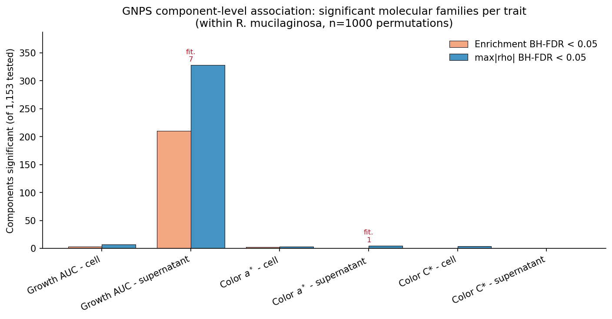
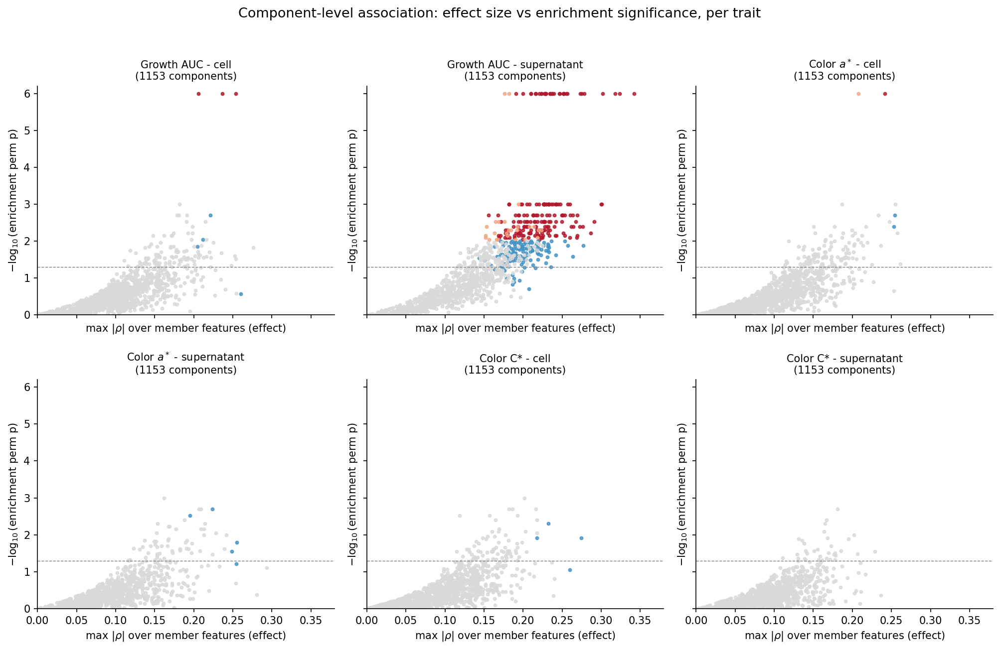
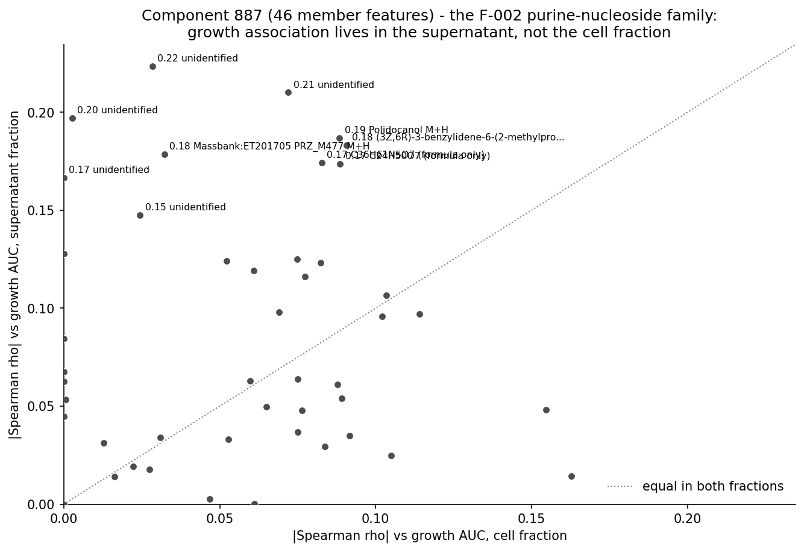
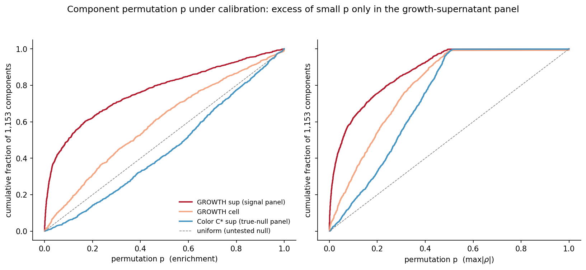

# GNPS molecular-network component-level association: growth rate & color within *R. mucilaginosa*

**Status:** preliminary &nbsp;|&nbsp; **Run date:** 2026-08-18 &nbsp;|&nbsp; **Script:** `analysis/scripts/network_component_association.py`
**Report Figures:** `analysis/scripts/network_component_report_figures.py` (regenerate with `python3 analysis/scripts/network_component_report_figures.py`)

---

## 1. What question this analysis asks

The prior feature-level tests ([F-019](../../.living/findings/abundance-axis-growth-rate-relationships.md), 218 / 10,230 cell features vs Cu-AUC) showed that almost all cell-fraction phenotype–metabolome signal is *between-species* (phylogenetic) and vanishes within *R. mucilaginosa*; the only within-species growth signal was 10 supernatant features (purine nucleosides + di/tripeptides) with a handful of hits surviving multiple-testing correction.

This analysis moves the same question **one level up**: instead of testing ~10,949 features independently, we group features that are connected in the GNPS/MS2 molecular network (`filtered_pairs.tsv` `ComponentIndex` — i.e. features sharing spectral-similarity edges, natural "molecular families") and test each **component** for association with the phenotype. Networks group chemically related molecules and reduce the multiple-testing burden from ~11k features to 1,153 families, so coordinated (but individually weak) signals can be detected that a feature-level FDR would bury.

**Targets** (all within *R. mucilaginosa*, the only species with n>200):

| trait key | phenotype | fraction |
|---|---|---|
| `growth_cell` / `growth_supernatant` | liquid growth rate, Cu-media AUC (`mean_auc_rate`) | cell / supernatant |
| `color_a_cell` / `color_a_supernatant` | CIELAB `a*` (`Mean_ColorLab_a*Mean`) | cell / supernatant |
| `color_C_cell` / `color_C_supernatant` | chroma C\* = √(a\*² + b\*²) | cell / supernatant |

A note on fractions (verified this session): AUC and color are **strain-level** phenotypes (cell-vs-supernatant correlations r=1.0, difference=0). The two fractions therefore carry *identical* phenotype values; the cell/supernatant contrast is purely a contrast of **which metabolome** (intracellular vs secreted) is correlated with that phenotype.

## 2. Data and inputs

| input | path | role |
|---|---|---|
| phenotype metadata | `analysis/linked_data/sample_metadata.csv.gz` | AUC / color / species / fraction |
| feature abundances | `analysis/linked_data/feature_abundance_matrix.csv.gz` | 594-sample TSS-normalized intensities |
| dedup map | `analysis/linked_data/ms_feature_dedup_groups.csv` | 10,949 representative features |
| MS2 network | `…/networking/filtered_pairs.tsv` (in the Rodeo `db` tree via `build_compound_summary`) | feature → `ComponentIndex` |

Pipeline per trait: subset metadata to the fraction (± *R. mucilaginosa*), collapse replicate samples per feature to a strain mean, rank-transform + normalize the abundance matrix, then Spearman-correlate each feature against the strain-mean phenotype (z-ranked). Feature identity is carried through the dedup-group representative map (fixed in the same session by grouping at the strain-representative level — 10,949 analysis reps, 6,057 network-mapped, 4,892 singletons/unmapped per trait).

## 3. Method: two component designs, permutation nulls, three correction layers

For each of the 1,153 components with ≥2 members (tested independently per trait):

1. **GSEA-style enrichment** — component score = mean(−log10 p) of its member features' per-feature p-values. Asks: *are the members collectively more associated than the panel-wide null?*
2. **max|ρ|** — component statistic = max |Spearman ρ| over members. Asks: *does the best member of a family exceed what any component's best member does under the null?*

Both are calibrated with a **permutation null** (n=1000, seed 42; phenotype shuffled within preserved component structure) to give per-component permutation p (`p_es_perm`, `p_maxrho_perm`), then:

- **BH-FDR** across components (`p_es_fdr`, `p_maxrho_fdr`), and
- a **familywise** bound `p_fdr_max`: the fraction of permutations where the *whole-panel* maximum max|ρ| is ≥ the component's value — a conservative family-wise error estimate that does not assume components are independent.

Care: components are NOT independent (they share latent chemistry), so the BH counts (which assume independence) overstate the number of independent discoveries; the familywise count is the safe upper bound on "real" families.

## 4. Results

### 4.1 Headline: significant molecular families per trait

| trait | enrichment BH<0.05 | max\|ρ\| BH<0.05 | familywise | enrichment perm-p<0.05 fraction |
|---|---|---|---|---|
| **growth AUC – supernatant** | **210 / 1,153** | **328 / 1,153** | **7** | **0.41** |
| growth AUC – cell | 3 / 1,153 | 7 / 1,153 | 0 | 0.10 |
| color a\* – cell | 2 | 3 | 0 | 0.10 |
| color a\* – supernatant | 0 | 5 | 1 | 0.05 |
| color C\* – cell | 0 | 4 | 0 | 0.06 |
| color C\* – supernatant | 0 | 0 | 0 | 0.03 (true-null control ≈ 5%) |



### 4.2 Finding 1 — growth biology is (nearly) entirely a supernatant/secreted phenomenon

The growth AUC signal is overwhelmingly in the **supernatant**: 210–328 of 1,153 molecular families pass BH-FDR and 7 survive the conservative familywise bound, while 41% of all tested components show enrichment perm-p<0.05 (vs 5% under a true null). The **cell fraction** has only a handful of nominally significant families (3 enrichment / 7 max|ρ|) and **zero** that survive the familywise bound — the intracellular metabolome barely tracks growth rate within the species.



The effect-size/enrichment scatter makes the asymmetry plain: only the growth-supernatant panel shows a dense cloud of components with both a large family max-|ρ| *and* strong enrichment p; the other five panels sit near the null region.

### 4.3 Finding 2 — the F-002 feature-level hit carries up to the family level (component 887)

The 10 supernatant features of [F-002](../../.living/findings/abundance-axis-growth-rate-relationships.md) live in component **887** (46 members; purine nucleosides — 2-methylthioadenosine (MTA)-like, methyl-substituted purine-2,6-dione nucleosides, isopentenyladenine-adjacent chemistry). At component level:

| panel | es p | es BH-FDR | max\|ρ\| | max\|ρ\| FDR | p_fdr_max |
|---|---|---|---|---|---|
| growth **supernatant** | 0.005 | **0.037** | 0.223 | 0.063 | 0.853 |
| growth **cell** | 0.179 | 0.631 | 0.163 | 0.365 | 1.0 |

So the purine-nucleoside family is significantly growth-associated in the *secreted* metabolome (BH-FDR 0.037) and not in the cell fraction — the feature-level result of F-002, replicated at family resolution.



### 4.4 Finding 3 — color remains null at component level (a 9th methodological angle)

Color `a*` and chroma C\* show no component-level association in either fraction (0–5 BH hits, 0–1 familywise; the single familywise nominal hit is in `color_a_supernatant` and does not survive the max|ρ| design). This agrees with the feature-level ([F-013](../../.living/findings/phenotype-metabolome-association-statistical-power.md)), class-aggregation ([F-017](../../.living/findings/phenotype-metabolome-association-statistical-power.md)) and differential-expression views: aggregating over chemistry does not rescue color signal.

### 4.5 Finding 4 — null calibration is sane

The permutation machinery behaves: the `color_C_supernatant` panel — a biologically a priori true-null — yields 0 BH hits, 0 familywise, and a 3% perm-p<0.05 fraction, consistent with the 5% FPR. The excess of small permutation p appears *only* in the growth-supernatant panel.



### 4.6 What's in the *tested-then-significant* growth families

The strongest growth-supernatant families by effect (from the identity tables):

| comp | n | max\|ρ\| | representative identities |
|---|---|---|---|
| 1642 | 3 | 0.342 | Lumichrome (riboflavin catabolite); His-Phe-Pro-Gly-Pro peptide; xanthoxycyclin-A-analog |
| 2262 | 5 | 0.324 | methyl-substituted purine-2,6-dione nucleoside; xanthine-like |
| 1162 | 10 | 0.318 | fatty-acyl PEG-ether ester (surfactant-like) |
| 3578 | 2 | 0.302 | benzyl-carbamoylmethyl peptide-like |
| 499 | 51 | 0.301 | 2-(6-aminopurin-9-yl)-5-(methylsulfanylmethyl)oxolane-3,4-diol (MTA-like adenosine); stearyl diethanolamide |

The chemistry reinforces the F-002 picture: **purine-nucleoside turnover (MTA/adenosine metabolism) and small peptides dominate the growth-linked secreted metabolome**, alongside lipidic/surfactant species — consistent with secreted nucleotide turnover and membrane/cell-wall economy scaling with growth rate.

## 5. Interpretation and caveats

- **Read the 210–328 BH counts with the 7-familywise number as the conservative bound.** Components are not independent; the broad supernatant signal is best thought of as a small number of shared latent biological axes (e.g. total secreted production density) that recruit many related families, not 300 independent pathways.
- **Division of labour is by fraction, not phenotype** (strain-level phenotype identical in both fractions). The finding is: *the secreted metabolome of faster-growing strains scales with growth rate; the intracellular metabolome does not*.
- **Singletons/unmapped features (4,892/trait) are not part of the component test** — they are reported per-feature in the `*_rhoperm.tsv` files only. A strong single-feature biology would be caught at feature level, not here.
- The `color_a_supernatant` familywise=1 hit is a borderline nominal effect; treat as part of the overall color null.

## 6. Where the tables live

### Raw outputs (`outputs/`)
| file | contents |
|---|---|
| [`outputs/README.txt`](outputs/README.txt) | run summary, top-8 components per trait |
| `outputs/<trait>_components.tsv` | one row per component (1,153/trait): `ComponentIndex, n_members, max_rho_abs, es, p_maxrho_perm, p_es_perm, p_fdr_max, p_es_fdr, p_maxrho_fdr` |
| `outputs/<trait>_rhoperm.tsv` | one row per feature (10,949/trait): `row ID, ComponentIndex, rho_abs, es_member, p_feature_perm, p_feature_fdr` (singletons = `ComponentIndex 0`) |

### Cross-referenced reports (`reports/` — union of significant + curated components, 366 total)
| file | contents |
|---|---|
| [`reports/component_by_trait.tsv`](reports/component_by_trait.tsv) | subset (366) × 6 traits = 2,196 rows, significance flags added |
| [`reports/component_summary.tsv`](reports/component_summary.tsv) | one row per reported component: member count, n identified, identity list, per-trait significance & stats |
| [`reports/component_feature_identity.tsv`](reports/component_feature_identity.tsv) | 2,596 member-feature rows with m/z, RT, adduct, and identity from exact GNPS library > SIRIUS structure > analog > formula |
| [`reports/component_feature_identity.csv`](reports/component_feature_identity.csv) | same, comma-separated |
| [`reports/component_feature_identity.html`](reports/component_feature_identity.html) | same, sortable/filterable in a browser |

### Figures (`figures/`)
| file | description |
|---|---|
| `figures/fig1_sig_components_by_trait.png/.pdf` | significant-family counts per trait, both designs, familywise annotated |
| `figures/fig2_effect_vs_enrichment_2x3.png/.pdf` | 6-panel volcano-style: family max|ρ| vs enrichment significance |
| `figures/fig3_component887_by_fraction.png/.pdf` | comp 887 member features, sup vs cell rho, labelled identities |
| `figures/fig4_permutation_calibration.png/.pdf` | ECDF of permutation p vs uniform null (signal vs null panels) |

## 7. Reproduce

```bash
# component-level association (n=1000 permutations, seed 42)
python3 analysis/scripts/network_component_association.py --nperm 1000

# cross-referenced identity reports
python3 analysis/scripts/network_component_sirius_report.py

# report figures
python3 analysis/scripts/network_component_report_figures.py
```

## 8. Follow-ups

- Re-test the same supernatant components against **other-metal AUC** once populated, and against **colony area** (the known biomass confound) as a negative control.
- Determine whether the broad supernatant signal is driven by a few latent axes (e.g. PCA/generative factors on the significant families) vs many independent pathways.
- Purine-nucleoside hypothesis: is secreted MTA/adenosine turnover biologically expected to scale with growth rate, or is it a batch/extraction artifact? (needs independent validation).
