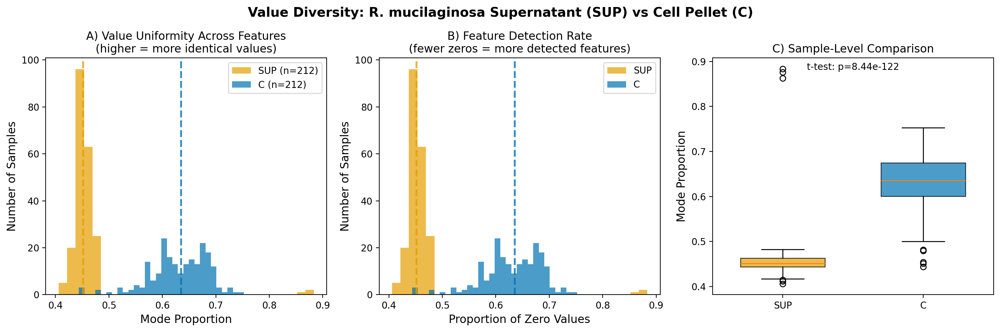
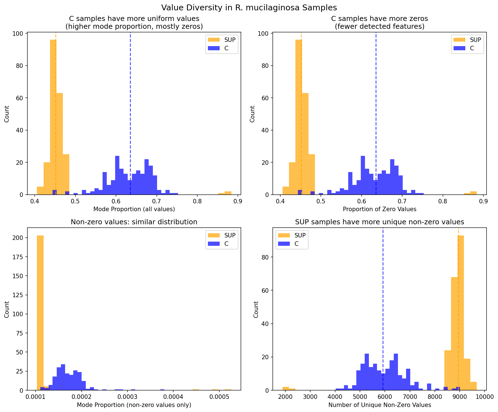
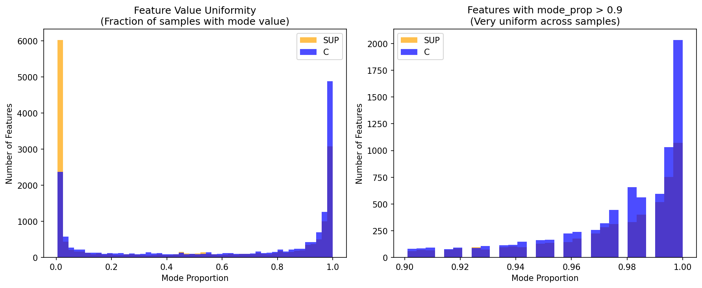

# Sample Value Diversity Analysis

## Overview

This analysis examines the diversity of peak area values within samples to investigate whether there is an excess of identical values across features. The analysis focuses on **R. mucilaginosa** samples, comparing SUP (supernatant) vs C (cell pellet) samples.

## Key Finding

**C (cell pellet) samples have significantly higher value uniformity than SUP (supernatant) samples.**

- C median mode proportion: **0.635**
- SUP median mode proportion: **0.452**
- Difference: 18.4% higher uniformity in C samples
- Statistical significance: **p = 8.44e-122**

This uniformity is largely driven by **higher proportion of zero values** in C samples (i.e., fewer features detected per cell pellet sample compared to supernatant).

## Methodology

### Data Sources
- Feature abundance matrix: `data/processed/EB_20260130_ExFAB_Rhodo_Sup_and_Pellet/b773ffa18c2b41e5a3484526293a54f9/aligned_features_ms2.csv.zst`
- Sample metadata: `analysis/linked_data/sample_metadata.csv.gz`

### Diversity Metrics Computed

| Metric | Description |
|--------|-------------|
| **Mode Proportion** | Fraction of feature values that equal the most common value |
| **Proportion Zero** | Fraction of features with zero peak area (not detected) |
| **Non-Zero Mode Proportion** | Mode proportion calculated only from non-zero values |
| **Number of Unique Values** | Count of distinct peak area values |

### Sample Selection
- Focused on R. mucilaginosa species (424 samples: 212 SUP, 212 C)
- Paired comparison between supernatant and cell pellet from same strains

## Results

### 1. Sample-Level Uniformity

C samples show higher mode proportions, meaning more of their feature values are identical to the most common value:



**Interpretation**: The C samples have a median mode proportion of 63.5%, meaning on average, 64% of feature values in a C sample are the same value (typically 0). SUP samples have lower uniformity with only 45.2% of values being the mode.

### 2. Feature Detection Rate

C samples detect fewer features (more zeros):



**Key observation**: The mode value for most features is 0 (not detected), and C samples have more of these zeros, suggesting either:
- Biological: Cell pellets contain fewer metabolites than culture supernatant
- Technical: Matrix effects suppressing feature detection in pellet samples

### 3. Feature-Level Uniformity

Examining uniformity at the feature level (across samples):



| Sample Type | Features with >90% mode proportion |
|-------------|-----------------------------------|
| SUP         | 5,285                             |
| C           | 7,684                             |

C samples have ~45% more features with very high uniformity (mostly zeros).

### 4. Non-Zero Value Diversity

When examining only non-zero values, both sample types show similar diversity:

- SUP median non-zero mode proportion: 0.0002
- C median non-zero mode proportion: 0.0004

**This suggests no evidence of features being "targeted" to the same non-zero value.**

## Scripts

All analyses were generated by:

**Primary script**: `scripts/sample_diversity_analysis.py`

This script:
1. Loads the feature abundance matrix and sample metadata
2. Filters to R. mucilaginosa samples
3. Computes multiple diversity metrics per sample
4. Generates comparison histograms

### Generated Output Files

| File | Description | Script |
|------|-------------|--------|
| `figures/value_diversity_comparison.png/pdf` | Main comparison figure with 3 panels | `sample_diversity_analysis.py` |
| `figures/sample_level_histograms.png/pdf` | Detailed histograms of all metrics | `sample_diversity_analysis.py` |
| `figures/feature_uniformity_histogram.png/pdf` | Per-feature uniformity analysis | Inline analysis |
| `figures/nonzero_diversity_histograms.png/pdf` | Non-zero value diversity | `sample_diversity_analysis.py` |
| `figures/sample_diversity_histograms.png/pdf` | Initial diversity exploration | `sample_diversity_analysis.py` |
| `sample_diversity_metrics.csv` | Full metrics per sample | `sample_diversity_analysis.py` |
| `sample_level_metrics.csv` | Extended metrics with non-zero analysis | `sample_diversity_analysis.py` |

## Conclusions

1. **C samples have higher value uniformity** - This is driven by higher zero rates (fewer detected features), not by features being targeted to a common non-zero value.

2. **No evidence of "targeting"** - No features show suspiciously non-zero identical values across all samples. The uniformity is biological/technical (more zeros in pellets).

3. **This is a paired difference** - For the same strain grown under the same conditions, cell pellets consistently show fewer detected features than supernatant samples.

## Reproducibility

To regenerate all figures and metrics:

```bash
python scripts/sample_diversity_analysis.py
```

Output location: `analysis/sample_diversity/figures/`
